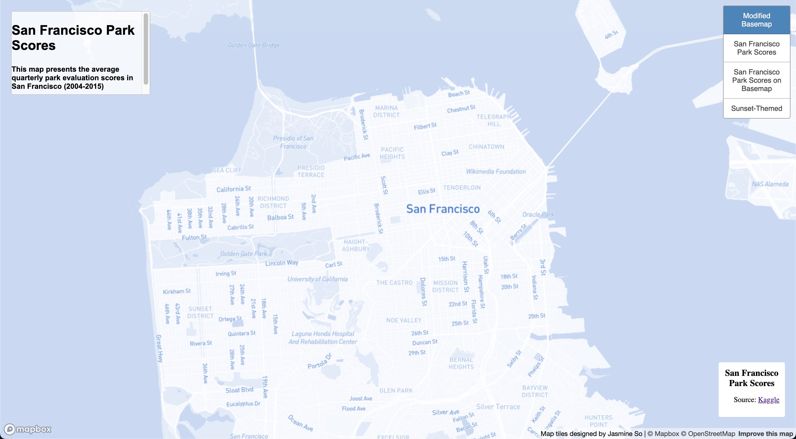
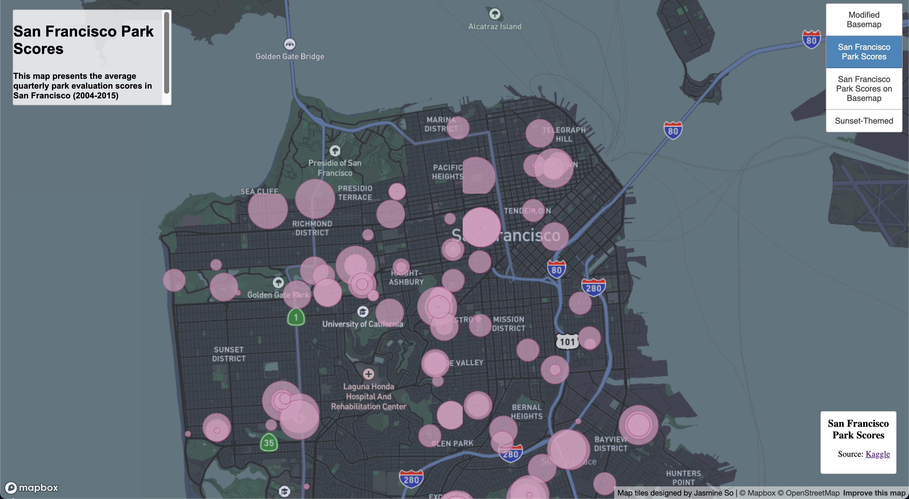
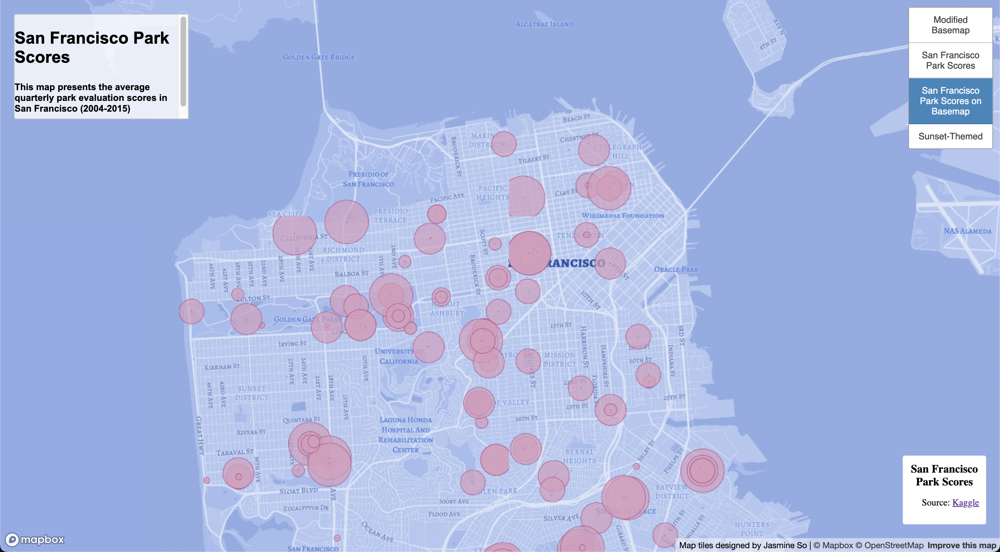
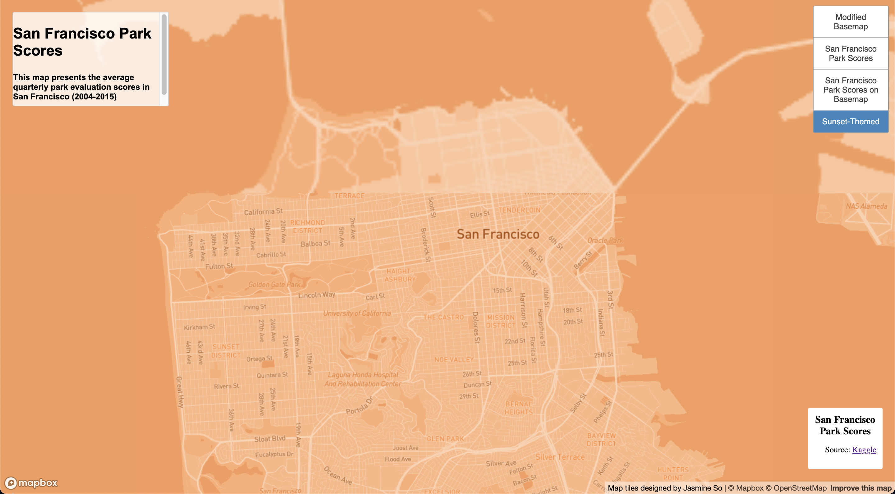

# geog458-lab4

# Lab 4: Map Design and Tile Generation 

[Access to Web Maps](http://127.0.0.1:5500/index.html)

## Tile Set 1 

Tile Set 1 and Map 1 is a basemap provided by MapBox to illustrate the geographical context of the study area, which is San Francisco. I have chosen to display the map in blue because baby blue is one of my favorite colors. I have also chosen the font to be `Alegreya`. The zoom level of this tile set is ranged `from 10 to 13`. The **width and height** of this tile is set to `256`, **quality** is `100` and **background transparency** is `0`.

## Tile Set 2

The second tile set is a thematic layer made by San Francisco Park Scores from Kaggle. I have used dot density on a navigation map. The dots are classified based on `Scores` into 7 classes, displaying in various sizes of **pink** circles on the map. The zoom level of this tile set is ranged `from 10 to 13`. The **width and height** of this tile is set to `256`, **quality** is `100` and **background transparency** is `0`. On the map, we are able to see the distributions of maps around San Francisco area. Most parks are located in the **downtown area** and **near number 1 freeway**. 

## Tile Set 3 

This map is composed of the thematic layer (from the second tile set), a dot density map based on the `Scores` of San Francisco Parks on the basemap (from the first tile set). Similiar to the first and second tile sets, the zoom level of this tile set is also ranged `from 10 to 13`. The **width and height** of this tile is set to `256`, **quality** is `100` and **background transparency** is `0`.

## Tile Set 4

The forth tile set is a map layer designed over Mapbox. Its main theme is sunset, referring to the nature, which orange is the main color. In Seattle, during sunset time, the sky is often pink because of the rain. I have lived in the San Francisco and bay area for a few years and its sunset always projects an **orange sky**. I have always missed my times in `bay area` and thus created a map in orange. The zoom level of this tile set is ranged `from 10 to 13`. The **width and height** of this tile is set to `256`, **quality** is `100` and **background transparency** is `0`.
